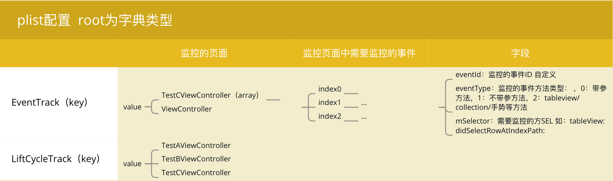

# UserBeheviorStatistical
用户行为轨迹统计demo

利用配置文件来针对指定页面对用户浏览页面以及用户行为相关的事件/方法进行统计，例如：点击按钮，tableview cell，collection item，手势等事件的数据。配置使用plist文件，基于Aspects来hook切面，统计数据存储使用FMDB存储在本地数据库，，适用于不需要全局监控，而针对指定的部分页面、用户响应事件，手势等的监控。由于不同的项目可能会有不同的需求，所以demo主要是提供一种实现的思路，具体的数据上传发送时机和细节处理需要根据需求自己做一些改变，如果你有更好想法或者您觉得这个做法有什么问题，欢迎issue告诉我。

### 工程结构以及如何使用

##### 工程工具类结构

```
.
├── UserBeheviorStatistical
│   ├── AspectsLocalStorage：切面数据存储器
│   ├── AspectMonitor：用户行为切面统计器
│   ├── Configuration：配置项 plist文件
```


##### 如何配置Configuration

demo中定义了一个`AspectsList.plist`文件用于配置需要监控的内容：



json的形式表示：

```json
{
    EventTrack =     {
        TestCViewController =         (
                        {
                eventId = FavoriteButton;
                eventType = 0;
                mSelector = "favoriteButtonResponse:";
            },
                        {
                eventId = CollectButton;
                eventType = 0;
                mSelector = "collecteButtonResponse:";
            },
                        {
                eventId = RepostButton;
                eventType = 1;
                mSelector = "repostButtonResponse:";
            },
                        {
                eventId = xianzhuo;
                eventType = 1;
                mSelector = duangButtonResponse;
            }
        );
        ViewController =         (
                        {
                eventId = mainTableView;
                eventType = 2;
                mSelector = "tableView:didSelectRowAtIndexPath:";
            }
        );
    };
    LiftCycleTrack =     (
        TestAViewController,
        TestBViewController,
        TestCViewController
    );
}
```

使用 ：

在`AppDelegate.m`中初始化工具类：

```objective-c
[[AspectsMonitor setupMonitor] statisticVCLifeCycleWith:@"AspectsList.plist" viewControllerKey:@"LiftCycleTrack"];
[[AspectsMonitor setupMonitor]statisticEventWith:@"AspectsList.plist" EventKey:@"EventTrack"];
[AspectsLocalStorage setupStorage];
```

获取上传数据

```objective-c
[[AspectsLocalStorage setupStorage]getData];
```


